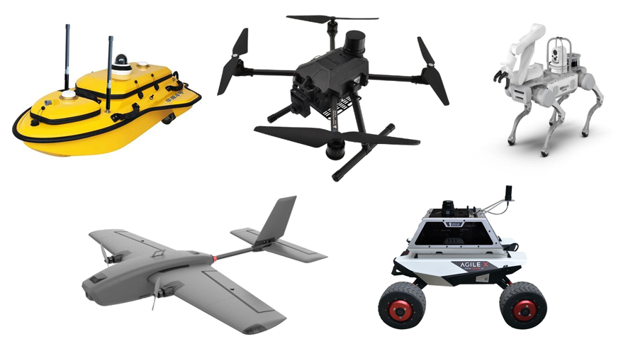
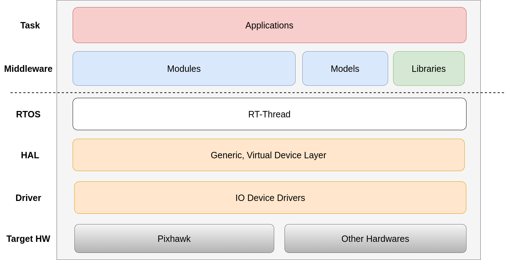
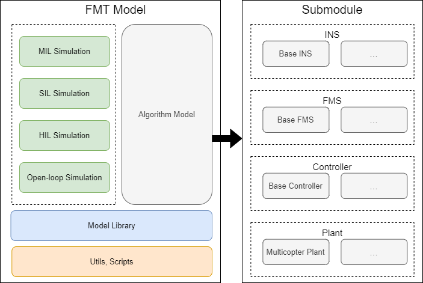
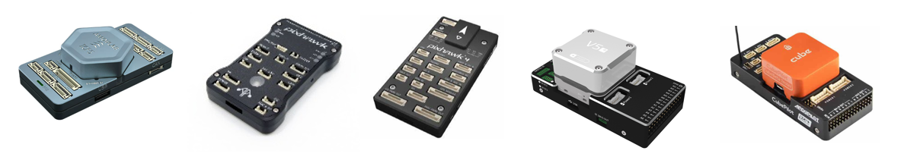

# Introduction

> An advanced autopilot system designed with Model-Based Design (MBD).

## What is Firmament?

Firmament (FMT) is an advanced autopilot system based on the Model-Based Design (MBD) methodology, which allows for the efficient and rapid development of high-quality control systems for a wide range of unmanned vehicles, including aerial vehicles, ground vehicles, marine vessels, and robots. With its intuitive graphical interface and extensive libraries of pre-built blocks, FMT provides users with a powerful toolset for building and testing complex control algorithms, as well as for generating highly optimized code for deployment on embedded systems. Furthermore, FMT is highly flexible and customizable, allowing users to tailor the system to their specific application requirements and to easily integrate it with other hardware and software platforms. As such, FMT is an ideal choice for researchers, developers, and engineers looking to quickly and effectively build and test control systems for a wide range of unmanned vehicle applications.

  

    
  

The system is a comprehensive and advanced autopilot solution that is primarily composed of two distinct parts: the *FMT-Firmware* and the *FMT-Model*.

- [FMT-Firmware](https://github.com/Firmament-Autopilot/FMT-Firmware): A powerful embedded system that has been specifically designed to provide users with a stable and high-performance platform for running control algorithms and processing sensor data in real-time. It is built using C/C++ programming languages and has been optimized for use on embedded systems. The firmware is extremely flexible and customizable, and it can be easily modified and adapted to suit a wide range of applications.

  

    
  

- [FMT-Model](https://github.com/Firmament-Autopilot/FMT-Model): A simulation framework that has been designed using MATLAB/Simulink. It provides a comprehensive platform for developing and testing control algorithms in a virtual environment, without the need for physical hardware. The FMT-Model includes a wide range of algorithm libraries, making it easy to implement advanced techniques such as control, inertial navigation system, guide system and so on. The simulation framework is highly customizable, allowing users to create their own models and scenarios, and to test the performance of their control algorithms under a range of different conditions.

  

    
  

## Why Firmament?

Model-based design provides an efficient approach for establishing a complex and safe control system. It has been widely used in many industries, primarily in the automotive and aerospace sectors. Currently there is few open-source autopilot system which is using Model-based Design and FMT-Autopilot is born to this. FMT provides an ideal platform to develop and test your own state-of-the-art algorithm and deploy it on various hardware or just run in simulator. FMT provides very powerful simulation capability to makes code debug and optimization much easier.

- High development efficency achieved with model-based deisign and debug easier.
- A stable and high performance embedded system designed with C/C++.
- A powerful simulation framework with various algorithm library designed with MATLAB/Simulink.
- Auto code generation from Simulink model adapted to different hardware platforms (ARM, AMD, Intel, etc).
- Excellent real-time performance based on [RT-Thread](https://www.rt-thread.io/) RTOS with active community and large number of third-party components.
- Support various hardware platform. Please refer to [target folder](https://github.com/Firmament-Autopilot/FMT-Firmware/tree/master/target).
- Cross-platform development tool support with Windows/Linux/Mac.
- Support with Mavlink v1.0/v2.0.
- Support with ROS1/ROS2.

## Support Hardware

FMT supports a wide range of open-source hardware platforms.

- [AMOV ICF5](https://github.com/Firmament-Autopilot/FMT-Firmware/blob/master/target/amov/icf5/README.md)
- [CUAV V5+](https://github.com/Firmament-Autopilot/FMT-Firmware/blob/master/target/cuav/v5_plus/README.md)
- [Pixhawk 4](https://github.com/Firmament-Autopilot/FMT-Firmware/blob/master/target/pixhawk/fmu-v5/README.md)
- [Pixhawk 2.4.6](https://github.com/Firmament-Autopilot/FMT-Firmware/blob/master/target/pixhawk/fmu-v2/README.md)
- [QEMU vexpress-a9](https://github.com/Firmament-Autopilot/FMT-Firmware/blob/master/target/qemu/qemu-vexpress-a9/README.md)

  

    
  
