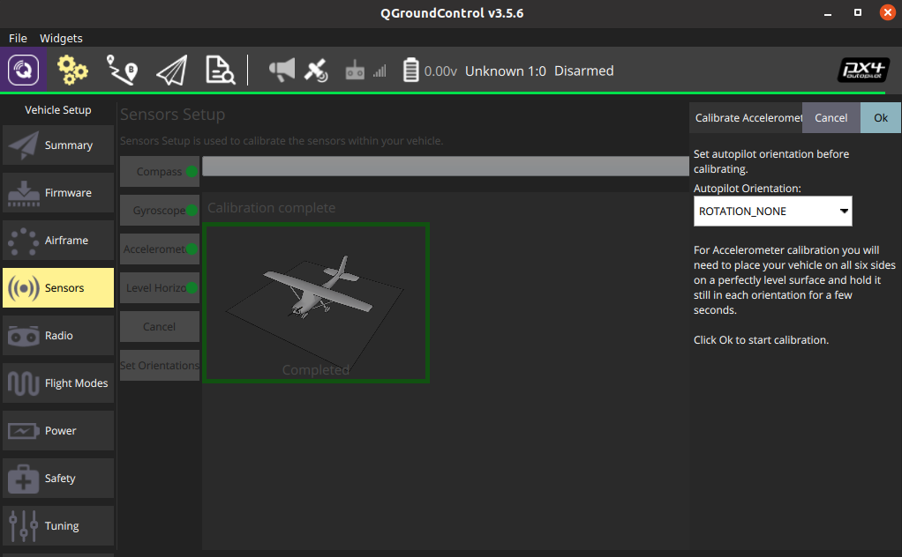
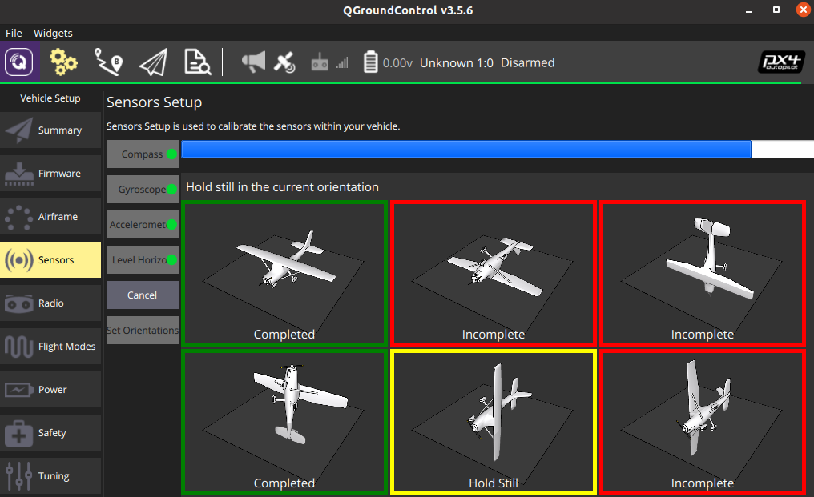

## Perform Calibration

The accelerometer calibration process is done via the QGroundControl interface. Follow the guide of QGroundControl to complete the calibration process.

1. Click the Accelerometer sensor button.



2. Click OK to start the calibration.
3. Position the vehicle as guided by the images on the screen. Once prompted (the orientation-image turns yellow) hold the vehicle still. Once the calibration is complete for the current orientation the associated image on the screen will turn green.



4. Repeat the calibration process for all vehicle orientations.

## Check & Save Result

1. The calibration result can be seen by typing `param list CALIB` in console.

```
msh />param list CALIB
CALIB:
......
       ACC0_XOFF: -0.265755
       ACC0_YOFF: 0.072022
       ACC0_ZOFF: -0.140535
    ACC0_XXSCALE: 0.999727
    ACC0_YYSCALE: 1.000000
    ACC0_ZZSCALE: 0.990056
    ACC0_XYSCALE: 0.000000
    ACC0_XZSCALE: 0.000000
    ACC0_YZSCALE: 0.000000
......
```

2. Save the calibration result by typing `param save` in console, otherwise the calibration result will lost when system power-off.