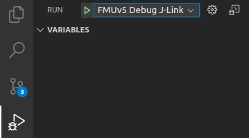
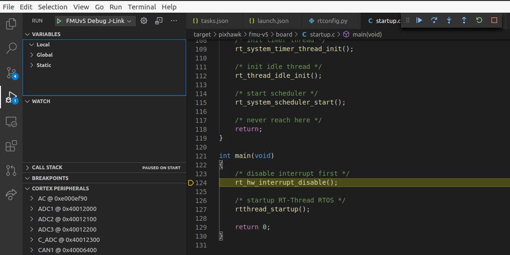

## Debug with J-Link

1. Install [J-Link Server](https://www.segger.com/downloads/jlink/) on your host system.
2. Create a new enviroment variable `JLINK_SERVER` and set the value to the path of J-Link server. e.g.

```
export JLINK_SERVER=~/opt/SEGGER/JLink_Linux_V686f_x86_64/JLinkGDBServer
```

3. Build fmt firmware with `BUILD = 'debug'` enabled in *rtconfig.py*.
4. Click Debug Run button in VS Code and select the right configuration for your target.



5. Click Start Debugging button.


