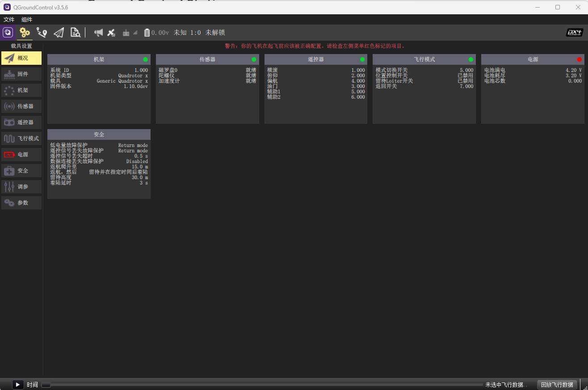
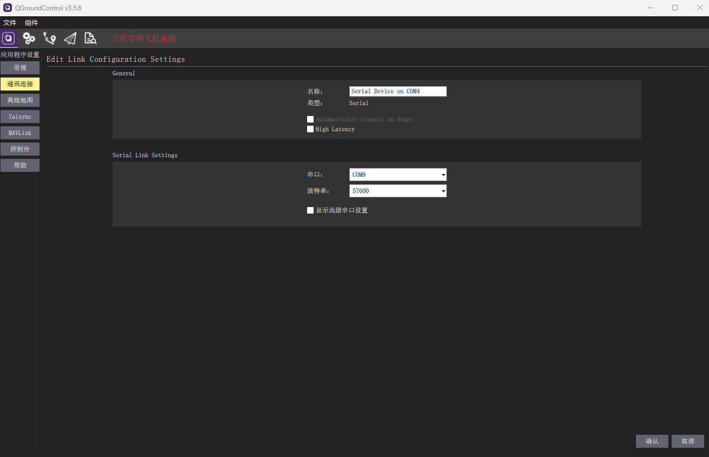

## Ground Control Station

FMT fully supports the standard Mavlink protocol, enabling seamless integration with any Ground Control Station (GCS) that supports Mavlink. In theory, this compatibility means that FMT can work with a wide range of GCS software that implements the Mavlink protocol. This flexibility allows users to choose the GCS that best suits their needs and preferences.

QGroundControl (QGC) 3.5.6 is the preferred GCS for FMT usage, which ensures a smooth and efficient experience when operating and configuring FMT-powered vehicles.

It is important to note that FMT does not have a custom-tailored version of QGC. Instead, it utilizes the QGC PX4 version. As a result, you may encounter some errors, such as missing parameters, when using QGC PX4 with FMT. This is normal since QGC PX4 is primarily designed for PX4 and may not be fully optimized for FMT. Despite these errors, FMT can still function correctly, and developers are continuously working to improve the integration between FMT and QGC for a smoother experience.

## Connect to GCS
To establish a connection between the Flight Controller and the GCS, you can either use a USB cable or telemetry.

For standard Pixhawk hardware, the QGC can automatically detect and connect to the Flight Controller, simplifying the setup process.

However, for other hardware configurations like ICF5, you may need to create the communication link manually. This involves configuring the communication parameters, such as baud rates and port, to establish a successful connection between the Flight Controller and the GCS.

