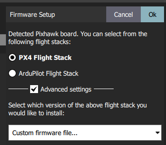

## Hardware

The current supported hardware platforms are [Pixhawk(FMUv2)](https://docs.px4.io/master/en/flight_controller/pixhawk.html) and [Pixhawk 4(FMUv5)](https://docs.px4.io/master/en/flight_controller/pixhawk4.html). Please visit the [websit](https://pixhawk.org/) to get more information about the hardware.

### FMUv2 Serial Port Mapping

|  UART   | Device  | Port |
|  ----   | ------  | ---- |
|  USART1 | serial6 | IO Debug |
|  USART2 | serial1 | TELEM1 |
|  USART3 | serial0 | TELEM2 |
|  USRT4  | serial2 | GPS |
|  USART6 | serial5 | FMT IO |
|  UART7  | serial4 | SERIAL 4/5 |
|  UART8  | serial3 | SERIAL 4/5 |

### FMUv5 Serial Port Mapping

|  UART   | Device  | Port |
|  ----   | ------  | ---- |
|  USART1 | serial3 | GPS |
|  USART2 | serial1 | TELEM1 |
|  USART3 | serial2 | TELEM2 |
|  USART6 | serial4 | TELEM3 |
|  UART7  | serial0 | FMU Debug |
|  UART8  | serial5 | FMT IO |

## Toolchain

FMT uses the following cross-platform toolchain (Windows/Linux/Mac):

- **Compiler**: [arm-none-eabi- toolchain](https://developer.arm.com/tools-and-software/open-source-software/developer-tools/gnu-toolchain/gnu-rm/downloads) (version:`7-2018-q2-update`， other version is not well tested).
- **Construction Tool**: [Scons](https://scons.org/) (You can use *pip install SCons* to install scons).
- **IDE**: [Visual Studio Code](https://code.visualstudio.com/).
- **USB Driver**: [STM32 USB Driver](https://www.st.com/en/development-tools/stsw-stm32102.html) (Only required for Windows).

## Build Firmware

Before building the firmware, please make sure the before mentioned toolchain are installed properly. Then you need add a new environment variable `RTT_EXEC_PATH` with the value set to compiler's path.

e.g. in Linux:

```shell
export RTT_EXEC_PATH=$arm-none-eabi-7-2018-q2-update/bin
```

Pixhawk consists of two processors, FMU (Flight Management Unit) and IO (Input/Output). So we need build firmware for each processor and download the firmware sequentially.

### Build FMU Firmware

First build the fmu firmware. Change your directory to a specific target and type command `scons` to start build process. The generated fmu firmware is located in `FMT-Firmware/target/pixhawk/fmu-v5/build`. 

e.g. To build pixhawk FMUv5 firmware, use the following command.

```shell
cd FMT-Firmware/target/pixhawk/fmu-v5/
scons -j4
```

> `-jN` allows N jobs at once which makes your build process quiker.

> If build fail, please clean the project with command`scons -c` then try to build again.

### Build IO Firmware

Then build the io firmware. Simply type the following command. The generated io firmware is located in `FMT-Firmware/target/pixhawk/fmt-io/project/build`.

```shell
cd FMT-Firmware/target/pixhawk/fmt-io/project
scons -j4
```

> If build fail, please clean the project with command`scons -c` then try to build again.

## Download Firmware

The download process requires pixhawk bootloader, so please make sure your pixhawk has bootloader flashed already. If not, please visit [PX4-Bootloader](https://github.com/PX4/PX4-Bootloader) to learn how to build and flash the bootloader for your hardware. FMT reuses the pixhawk bootloader, therefore you can easily flash back to other firmware such as PX4 or APM.

Currently there are three methods to download the fmu firmware,:

- **Upload Script**: Change directory to a specific target and type `python uploader.py`. Then connect your hardware to PC via a usb cable, the download shuold start automatically.

```
~/FMT-Firmware/target/pixhawk/fmu-v5$ python3 uploader.py 
waiting for the bootloader...
Auto-detected serial ports are:
Not found fmt_fmu,please connect fmt_fmu!
Not found fmt_fmu,please connect fmt_fmu!
Not found fmt_fmu,please connect fmt_fmu!

Found board id: 50,0 bootloader version: 5 on /dev/serial/by-id/usb-3D_Robotics_PX4_BL_FMU_v5.x_0-if00
sn: 0021001c3438510636363539
chip: 10016451
family: b'STM32F7[6|7]x'
revision: b'Z'
flash: 2064384 bytes
Windowed mode: False

Erase  : [====================] 100.0%
Program: [====================] 100.0%
Verify : [====================] 100.0%
Rebooting. Elapsed Time 6.803

```

> If download is not started, unplug your usb cable then try it again.

- **QGoundControl**: Go to **Firmware Setup** page，then connect your hardware to PC with a usb cable. In pop-up diaglog，select **Advanced Settings**->**Custom firmware file** with `fmt_fmu.bin` firmware.



- **JLink**: Please refer to [Debug](introduction/debug.md) section.

If download success, power on the board and the system banner should be printed on `serial0` (serial0 is the default serial used by console). If you don't have a serial cable, you can also connect to console via QGroundControl **Mavlink Console**.

```
   _____                               __ 
  / __(_)_____ _  ___ ___ _  ___ ___  / /_
 / _// / __/  ' \/ _ `/  ' \/ -_) _ \/ __/
/_/ /_/_/ /_/_/_/\_,_/_/_/_/\__/_//_/\__/ 
Firmware....................FMT FMU v0.1.0
Kernel....................RT-Thread v3.0.5
RAM.................................512 KB
Target......................Pixhawk4 FMUv5
Vehicle.........................Quadcopter
INS Model..................Base INS v0.1.0
FMS Model..................Base FMS v0.1.0
Control Model.......Base Controller v0.1.0
Task Initialize:
  comm..................................OK
  logger................................OK
  fmtio.................................OK
  status................................OK
  vehicle...............................OK

msh />
```

The next step is to upload the `io firmware` which is downloaded through the fmu. First copy the io firmware `target/pixhawk/fmt-io/project/build/fmt_io.bin` to the on board sd card. You can do that via QGroundControl ftp (version 3.5.6, the FTP function is removed on higher version) or a sd card reader. Then type the following command in fmt console to upload the firmware to io processor.

```
msh /usr>fmtio upload /usr/fmt_io.bin
[312785] I/Uploader: sync success
[312793] I/Uploader: found bootloader revision: 5
[312803] I/Uploader: io firmaware:/usr/fmt_io.bin
[312818] I/Uploader: erase...
[314151] I/Uploader: program...
[316275] I/Uploader: CRC check ok, received: 8a27ed4f, expected: 8a27ed4f
```

> On the first time to download the io firmware, you should click the io reset button after typing `fmtio upload` command to let io enter bootloader.

After the download is complete, type `fmtio hello` command. You should see the following message which sent from the io processor.

```
msh />fmtio hello
msh />[IO]:Hello, this is FMT IO!
```

Congratulation! Now you have FMT up and running. :)