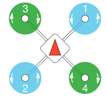
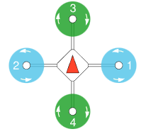
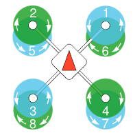
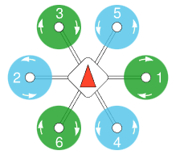
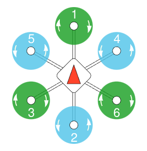
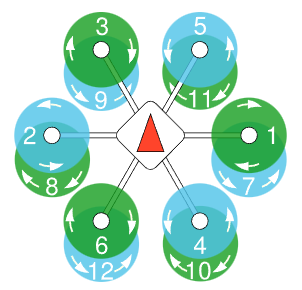
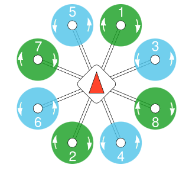
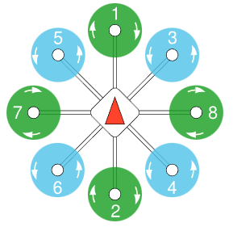
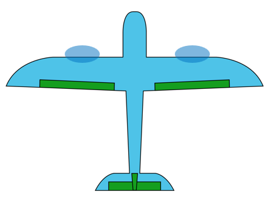

## Vehicle/Airframe

FMT is capable of controlling many vehicles and airframes, and it's easy to add algorithms to control even more vehicles.

This document aims to list these options. However, please note that it's still a work in progress and not yet complete.

We gladly welcome the contribution to support a broader range of vehicle types.

#### Multicopter
| Airframe                        | Build Command                             | Description                          |
| ------------------------------- | ----------------------------------------- | ------------------------------------ |
| Quadcopter x, Airframe=1        | scons --vehicle=Multicopter --airframe=1  |      |
| Quadcopter +, Airframe=2        | scons --vehicle=Multicopter --airframe=2  |      |
| Coxial Quadcopter x, Airframe=3 | scons  --vehicle=Multicopter --airframe=3 |  |
| Hexacopter x, Airframe=4        | scons --vehicle=Multicopter --airframe=4  |      |
| Hexacopter +, Airframe=5        | scons --vehicle=Multicopter --airframe=5  |      |
| Coxial Hexacopter x, Airframe=6 | scons --vehicle=Multicopter --airframe=6  |  |
| Octocopter x, Airframe=7        | scons --vehicle=Multicopter --airframe=7  |      |
| Octocopter +, Airframe=8        | scons --vehicle=Multicopter --airframe=8  |      |

#### Fixwing
| Airframe                     | Build Command                        | Description                       |
| ---------------------------- | ------------------------------------ | --------------------------------- |
| Standard Fixwing, Airframe=1 | scons --vehicle=Fixwing --airframe=1 |  |


## Show Vehicle/Airframe Type
When the system is up and running, the vehicle and airframe are displayed in the system banner. You can also use the `boot_log` command to view the system banner.
```shell

   _____                               __
  / __(_)_____ _  ___ ___ _  ___ ___  / /_
 / _// / __/  ' \/ _ `/  ' \/ -_) _ \/ __/
/_/ /_/_/ /_/_/_/\_,_/_/_/_/\__/_//_/\__/
Firmware.....................FMT FW v0.5.5
Kernel....................RT-Thread v4.0.3
RAM.................................448 KB
Target...........................Amov-ICF5
Vehicle........................Multicopter
Airframe.................................1
INS Model..................Base INS v0.3.2
FMS Model..................Base FMS v0.4.0
Control Model.......Base Controller v0.2.4
Task Initialize:
  mavobc................................OK
  mavgcs................................OK
  logger................................OK
  status................................OK
  vehicle...............................OK
```
