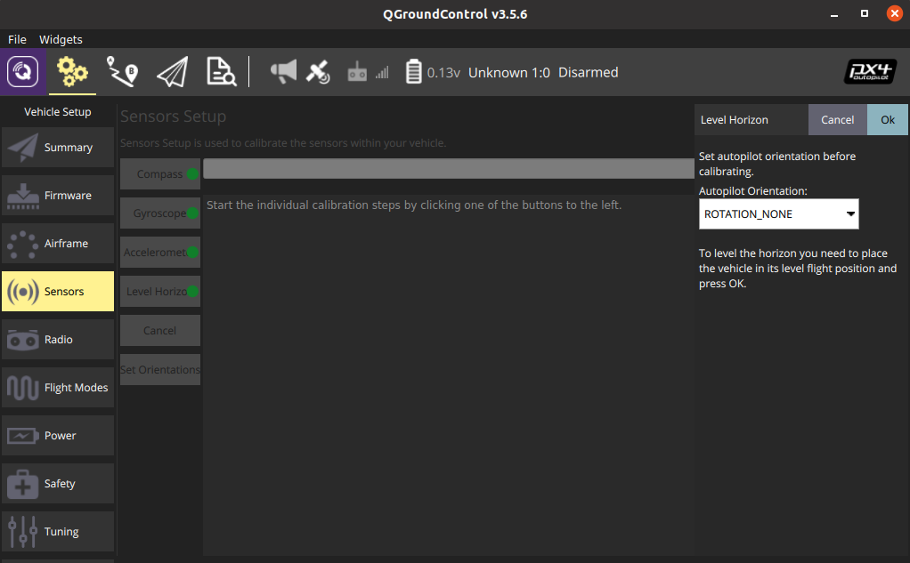
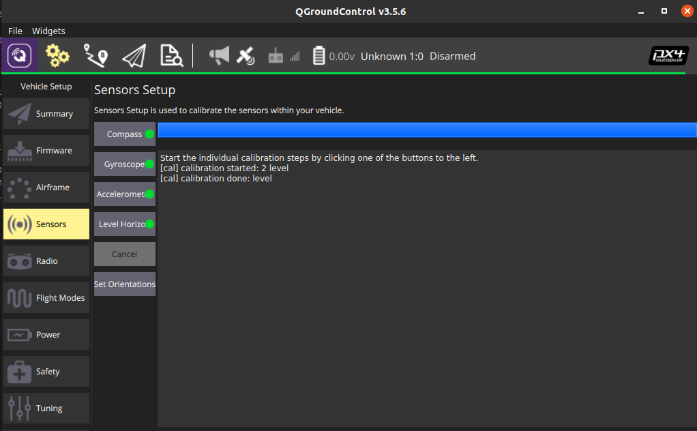

## Perform Calibration

The level horizon calibration process is done via the QGroundControl interface. Follow the guide of QGroundControl to complete the calibration process.

1. Click the Level Horizon button.



2. Place the vehicle in its level flight orientation on a level surface.
3. Press OK to start the calibration process.
4. Wait until the calibration process is finished.



## Check & Save Result

1. The calibration result can be seen by typing `param list CALIB` in console.

```
msh />param list CALIB
CALIB:
......
      LEVEL_XOFF: -0.017828
      LEVEL_YOFF: -0.000741
      LEVEL_ZOFF: 0.000000
```

2. Save the calibration result by typing `param save` in console, otherwise the calibration result will lost when system power-off.