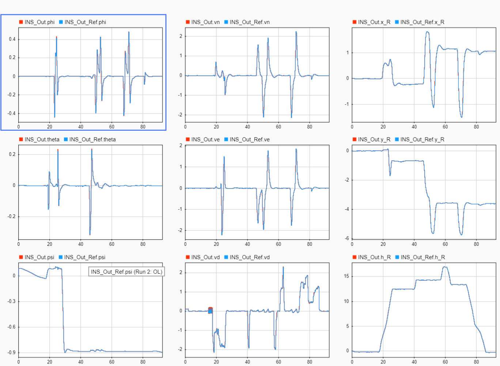

## Logging

FMT provides three kinds of log to empower the debug capability.

### Boot Log

Boot log module records boot process console output. Which is useful to check system startup information.

```
msh />cat /log/session_5/boot_log.txt

   _____                               __ 
  / __(_)_____ _  ___ ___ _  ___ ___  / /_
 / _// / __/  ' \/ _ `/  ' \/ -_) _ \/ __/
/_/ /_/_/ /_/_/_/\_,_/_/_/_/\__/_//_/\__/ 
Firmware....................FMT FMU v0.0.1
Kernel....................RT-Thread v3.0.5
RAM.................................512 KB
Target......................Pixhawk4 FMUv5
Vehicle.........................Quadcopter
INS Model..................Base INS v0.1.0
FMS Model..................Base FMS v0.1.0
Control Model.......Base Controller v0.1.0
Task Initialize:
  comm..................................OK
  logger................................OK
  fmtio.................................OK
  status................................OK
  vehicle...............................OK
```

### Text Log

Ulog is a very simple and easy to use component provided by RT-Thread. It provides the interface to write the text information to various backend, such as console, file system, etc.

```
[1708] W/Status: FMS Unknown Mode
[1714] I/Status: FMS Status Disarm
[5479] I/Status: FMS Position Mode
[8268] I/Status: FMS Altitude Hold Mode
[9104] I/Status: FMS Manual Mode
[13034] I/Status: FMS Status Standby
[15005] I/Status: FMS Status Arm
[21673] I/Status: FMS Status Disarm
```

> FS backend is disabled by default. You can add `#define ENABLE_ULOG_FS_BACKEND` in *fmtconfig.h* to enable it.

### Data Log

Mlog module provides the ability to record large amount of data in real-time, which can be laterly parsed into *.mat* files. 

To start logging, you can type command `mlog start` in console and the command `mlog stop` to stop logging. `mlog status` command will print out what kind of data and how many messages are recorded.

```
msh />mlog start
[3683] I/MLog: start logging:/log/session_10/mlog1.bin
msh />mlog status
log file: /log/session_10/mlog1.bin
"IMU"                id:1   record:2124     lost:0
"MAG"                id:2   record:427      lost:0
"Barometer"          id:3   record:428      lost:0
"GPS_uBlox"          id:4   record:44       lost:0
"Rangefinder"        id:5   record:1        lost:0
"Optical_Flow"       id:6   record:1        lost:0
"Pilot_Cmd"          id:7   record:1        lost:0
"INS_Out"            id:8   record:44       lost:0
"FMS_Out"            id:9   record:44       lost:0
"Control_Out"        id:10  record:44       lost:0
```

The MLog start/stop process can also be controlled by the parameter `MLOG_MODE`. You can use `param` command to change the value. Don't forget to use `param save` after value change. Otherwise all unsaved parameter will resume its default value on next boot.

```c
PARAM_GROUP(SYSTEM)
PARAM_DECLARE_GROUP(SYSTEM) = {
    /* Determines when to start and stop logging.
	0: disabled
	1: when armed until disarm
	2: from boot until disarm
	3: from boot until shutdown  */
    PARAM_DEFINE_INT32(MLOG_MODE, 0),
};
```

The [script](https://github.com/Firmament-Autopilot/FMT-Model/blob/master/utils/log_parser/parse_mlog.m) can be used to parse the log file and generate *.mat* files. Load *.mat files to Matlab for visualization and simulation.


