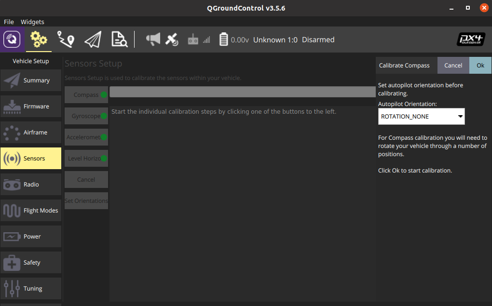
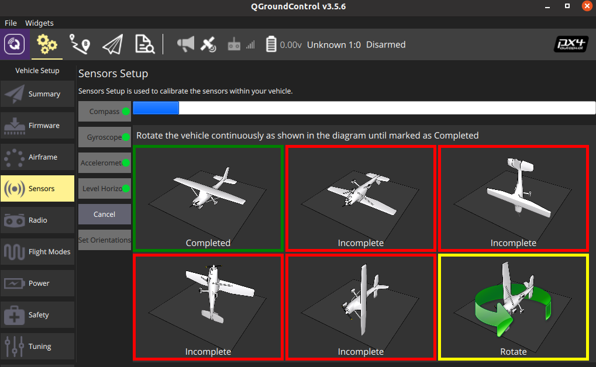

## Perform Calibration

The compass calibration process is done via the QGroundControl interface. Follow the guide of QGroundControl to complete the calibration process.

1. Click the Compass sensor button.



2. Click OK to start the calibration.
3. Place the vehicle in any of the orientations shown in red (incomplete) and hold it still. Once prompted (the orientation-image turns yellow) rotate the vehicle around the specified axis in either/both directions. Once the calibration is complete for the current orientation the associated image on the screen will turn green.



4. Repeat the calibration process for all vehicle orientations.

## Check & Save Result

1. The calibration result can be seen by typing `param list CALIB` in console.

```
msh />param list CALIB
CALIB:
......
       MAG0_XOFF: -0.025247
       MAG0_YOFF: -0.067397
       MAG0_ZOFF: -0.136934
    MAG0_XXSCALE: 0.863891
    MAG0_YYSCALE: 0.912510
    MAG0_ZZSCALE: 0.931017
    MAG0_XYSCALE: 0.010489
    MAG0_XZSCALE: -0.022396
    MAG0_YZSCALE: 0.076960
......
```

2. Save the calibration result by typing `param save` in console, otherwise the calibration result will lost when system power-off.